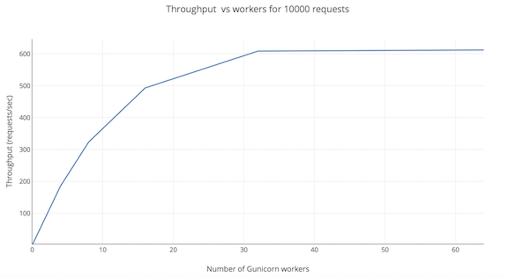
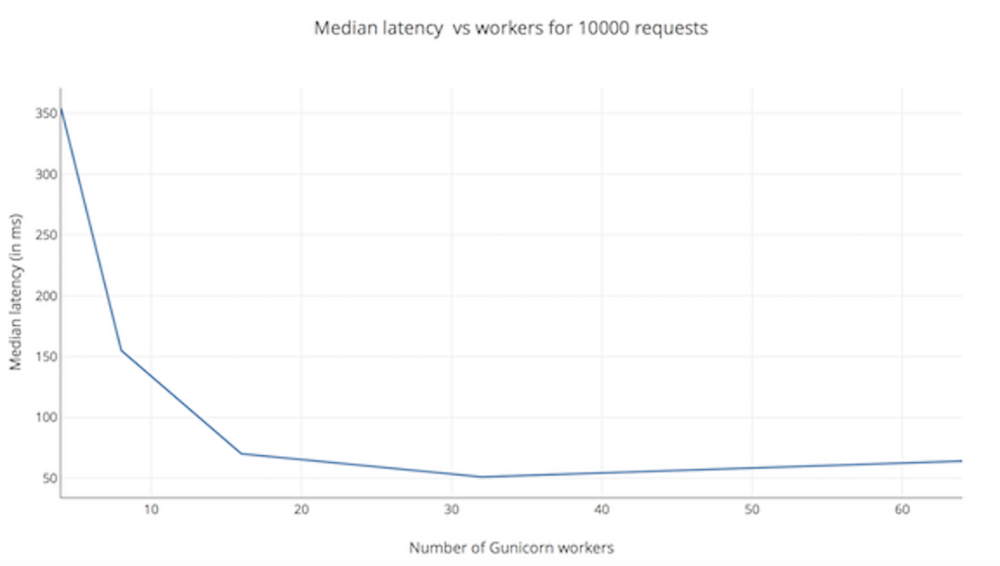
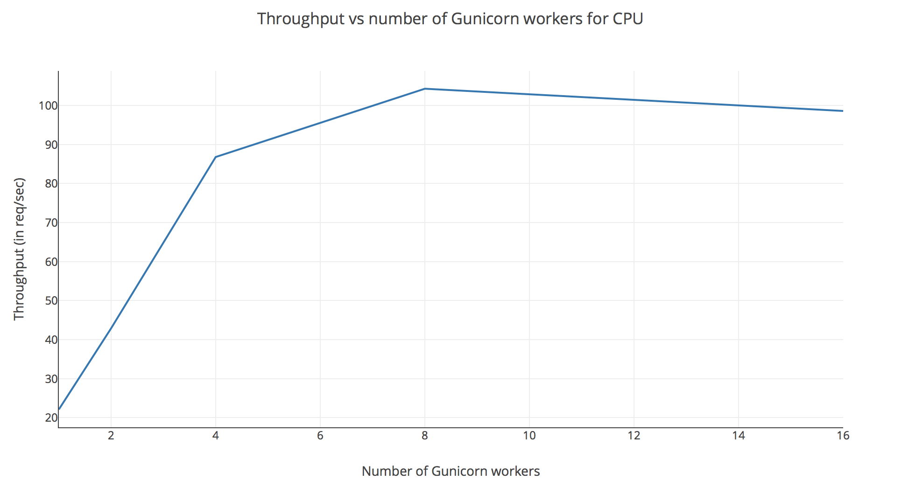
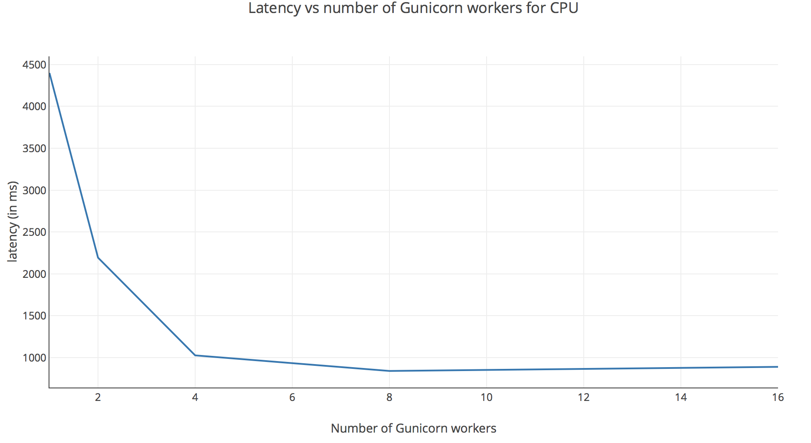

# Optimised configuration for EC2 instances for MMS in containers
We performed a series of experiments to come up with optimised configurations for ec2 instances for GPU and CPU usage and based on these experiments we published optimised configurations for c5.2xlarge(CPU instance) and p3.8xlarge (GPU instance). 
## Experiment details
We came up with the configurations after performing experiments for CPU and GPU instances to study metrics like throughput and latencies when the server receives concurrent requests.  The experiment details are as discussed below.
* Server  tested: MXNet Model Server 0.3 
* MXNet build used : mxnet-cu90mkl 1.1.0b20180215 for GPU (with MKL) / mxnet-mkl 1.1.0b20180215 for CPU (with MKL)
* Model: Resnet-18 (https://s3.amazonaws.com/model-server/models/resnet-18/resnet-18.model)
* Input-type to model: Image/JPG (RGB image of 3 X 224 X 224)
* Input : github.com/awslabs/mxnet-model-server/blob/master/load-test/test.jpg
* EC2 Instance Types: P3 8xlarge (4 GPUs, 32 vCPUs) / c5.2xlarge (8 CPUs)
* GPU image used: [MMS GPU Docker image](https://hub.docker.com/r/awsdeeplearningteam/mms_gpu/)
* CPU image used: [MMS CPU Docker image](https://hub.docker.com/r/awsdeeplearningteam/mms_cpu/)

We varied number of concurrent workers(C) sending request (R) making a total (R*C) requests to server. We varied the parameters mentioned below and have discussed the results in respective sections.

## Number of Gunicorn workers (workers)
The number of Gunicorn workers should be equal to the number of vCPUs in the ec2 instance. We varied number of Gunicorn workers and studied throughput and latencies for both GPU(p3.8xlarge) and CPU(c5.2xlarge) instance. The plots below shows how these metrics varies with number of workers.

* **Experiments on GPU( p3.8xlarge with 32 vCPUs and 4 GPUs)**

The plots below shows how throughput and median latency varied for 100 requests from 100 concurrent workers with number of Gunicorn workers on p3.8xlarge instance. 

We can see that the throughput becomes constant after 32 workers while latency increases a bit suggesting 32 workers to be optimal for the instance.

* **Experiments on CPU( c5.2xlarge with 8 vCPUs)**

We performed similar experiments for CPU (100 requests from 100 concurrent workers) and got the following results for latency and throughput when we varied number of Gunicorn workers.

We also found similar results for CPU as shown in the above plots i.e throughput is highest when there are 8 workers(which equals number of vCPUs in c5.2xlarge)
**Based on the results, we recommend setting number of Gunicorn workers equal to number of vCPUs present in the instance.**

Note: The higher latencies seen during the load tests on CPU instance is becausethe C5.2xlarge CPU instance has 1/4th the total number of vCPUs as compared the p3.8xlarge GPU instance and both were serving the same number of incoming request. We had seen comparable latencies when the rate of requests coming into c5.2xlarge instance were reduced by 1/4th. Apart from it, the GPU alse shares some workload of CPUs avoiding any backlogs and hence better latency numbers.

However, the number published in [mms_app_gpu.conf](../docker/mms_app_gpu.conf) and [mms_app_cpu.conf](../docker/mms_app_cpu.conf)  are based on above experiments and optimised for the above ec2 instances.You may need to change the number of workers in [mms_app_gpu.conf](../docker/mms_app_gpu.conf)/ [mms_app_cpu.conf](../docker/mms_app_cpu.conf) based on the GPU/CPU you use. The performance may vary based on the model used.

## Number of GPUs (num-gpu)
The best performances are obtained using all the available GPUs available on the system. Experiments shows that it linearly scales throughput . By default, MMS identifies number of available GPUs and assign context of Gunicorn worker threads to each of them in round robin fashion. However, you can configure the number of GPUs in  you want to use in the [mms_app_gpu.conf](../docker/mms_app_gpu.conf) to use only few of the available instances.

## Performance on high loads 
After setting number of workers and GPUs as described above, we ran experiments to understand scale of request which MMS can handle. The containerised GPU version of MMS was able to give throughput of 650 requests/second without any error when it was bombarded by request from 600 concurrent workers sending 100 request each. 

